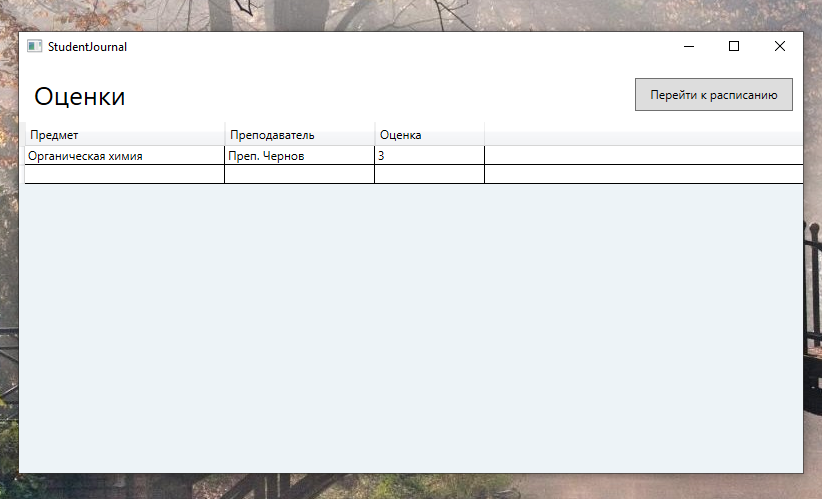

# SchedulePlanner
Приложение для просмотра и редактирования расписания для студентов и преподавателей

## Возможности 

- Авторизация по роли (студент / преподаватель)
- Просмотр оценок студентами
- Просмотр раписания как студентами, так и преподавателями
- Добавление занятий преподавателями
- Автоматическая генерация базы данных с тестовыми данными

При этом: 

- Студенты при просмотре расписания видят пары только своей группы
- При просмотре оценок студенты видят только те оценки, которые были поставлены непосредственно им
- При добавлении пары в расписание  учитывается **специализация каждого преподавателя**: при выборе преподавателя круг возможных предметов сужается до тех, которые он может вести. Так же и наоборот: при выборе, например, предмета "Математика" становится невозможным выбрать преподавателя, ведущего русский язык и литературу
- Важно: дату и время занятия нужно вводить в следующем формате: 11.05.2025 18:42

## Установка и запуск

1. Клонируйте репозиторий:
    ```bash
    git clone https://github.com/PakSerg/SchedulePlanner.git
    cd SchedulePlanner
    ```

2. Запустите Docker-контейнеры:
    ```bash
    docker-compose up --build
    ```

    В проекте используется один контейнер для MS SQL Server. При запуске происходит автоматическое создание базы данных и таблиц, а также вставка тестовых данных.

3. Запустите проект WPF

## Данные для входа

Пароль у **всех** тестовых аккаунтов одинаковый: pass123

### Преподаватели 

- andreev.t
- belova.t
- chernov.t
- demina.t
- egorov.t

### Студенты 

- alisa.i
- boris.s
- vika.k
- dmitry.o
- katya.l

  ## Галерея

### Страница авторизации

<p align="center">
  
</p>

### Страница расписания

<p align="center">
  
</p>

### Страница с оценками

<p align="center">
  
</p>
